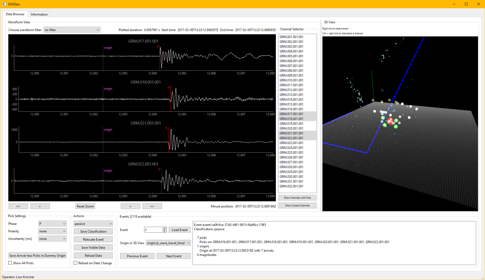

# Graphical Interface

The graphical interface can be launched with

```bash
dug-seis gui --operator="Your Name" --config=path/to/dug_seis_config.yaml
```

which opens a window akin to the following:



It is largely divided into three sections (left, right, bottom):

1. The left part shows the interactive waveform browser to visualize and pick
   data.
2. The right window contains the 3-D view of the channels and events.
3. The bottom part contains various buttons, settings, and detailed information.

## Usage

Most things should become clear after using it for a bit.

A few clarifications:

### Picking

* Double clicking in a waveform plot with an active event will set a pick.
* The active pick settings are in the bottom left.
* Automatic picks are red, manual picks are green.
* Manual picks can be moved and deleted.
* Delete a pick by Ctrl + Left clicking it.
* Picks are only stored in the database if they are used in a relocation or if
  the "Save Arrival-less Picks in Dummy Origin" button is pressed. This will
  cause DUGSeis to collect all Picks that don't have an arrival object that uses
  it to be collected into a new origin that is then saved in the database.


### 3-D View

* Many things can be configured in a project's YAML file.
* Left mouse click orbits/rotates.
* Middle mouse click translates.
* Mouse wheel zooms.
* Ctrl + mouse wheel changes the focal length.


### Saving Data

* The "Save Visible Data" button will open a dialog to save whatever waveform
  data is currently shown to disk.

### Pick Viewing

The "Show All Picks" check box in the bottom left will cause all picks in the
database to be shown.

### Data Reloading

Data can be manually reloaded from disc (for example if the database changed
externally or new waveform data became available). Press the "Reload Data" button for that.

Alternatively the graphical interface can periodically monitor the waveform
data
 folders and the database for changes and reload on any potential data
changes.
 The ping interval in seconds can be configured with the
`graphical_interface.data_monitoring_ping_interval` setting. There is a certain
cost to doing this so don't set this too low.