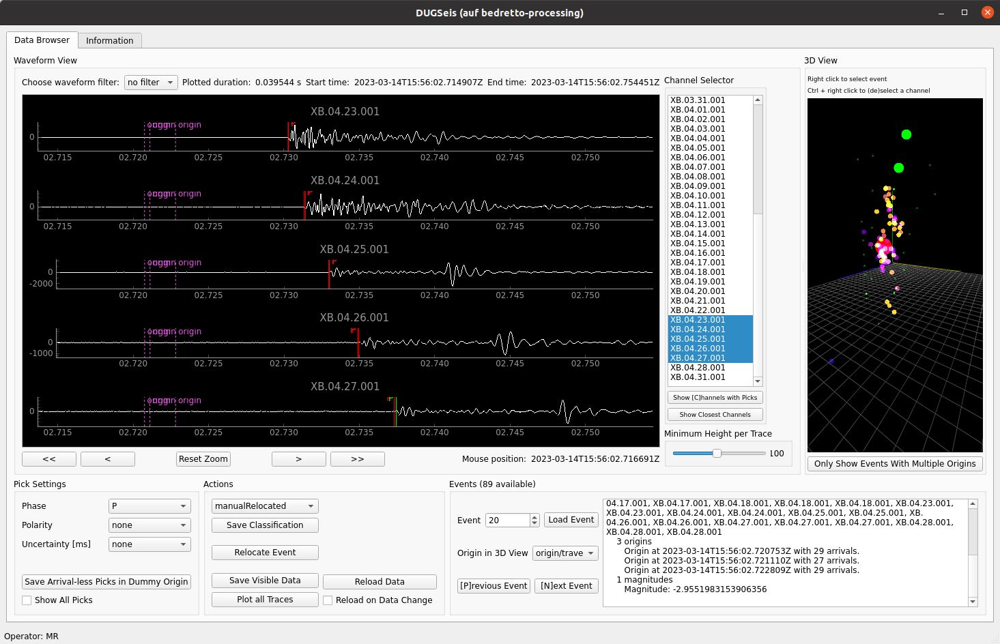

# Summary
Detecting earthquakes and compiling the events into earthquake catalogs are fundamental tasks in seismology. Acoustic 
emission sensors allow for the detection of the tiniest so-called picoseismic events, representing fractures on the 
cm or dm scale (-5<magnitude<0). Even smaller seismic events are recorded in the laboratory. Picoseismic events have 
corner frequencies of 1 kHz - 100 kHz. They are typically recorded with sampling frequencies of 200 kHz to 1 MHz and 
cannot be handled by standard seismic processing software that is developed for signals with frequencies f<500 Hz. 
Commercial software for continuous recording and processing of picoseismicity exists (e.g., GMuG-conti, fastloc.REEL) 
and is successfully used in scientific in-situ experiments (e.g., hydraulic stimulation, earthquake nucleation, 
nuclear waste disposal). However, commercial software comes with restrictions that are undesirable for university-based
in-situ experiments in underground laboratories; where tailoring the software to experiment with specific questions or
adding newly developed analysis techniques are routine operations in order to advance the study of the rock response 
in greater detail. The open-source DUGseis software package fills this gap. It has been developed to manage, process, 
and visualize continuous, high-frequency seismic data. The package can be used to create real-time and post-processing
earthquake catalogs and to directly visualize their event waveforms and locations in a graphical interface. Since the 
software is Python-based, users can easily add their own processing routines.

# Statement of need
The open-source, Python-based DUGseis package is designed to align with the functionalities of 
SeisComP [@seiscomp], a standard software used in microseismic large-scale earthquake processing (<500Hz, M>-0.5). 
DUGseis is tailored to picoseismic events (-5<M<0) with much higher frequency ranges between 1 kHz and 100 kHz [@Plenkers2022], as recorded by 
acoustic emission sensors (AE sensors). High-frequency seismic data processing is common in mining environments to 
monitor tunnel stability and has become very popular in underground laboratories [@Plenkers2022]. To date, many projects 
have used commercial software (e.g., GMuG-conti from GMuG Gesellschaft für Materialprüfung und Geophysik, Bad Nauheim/Germany,
www.gmug.eu or fastloc.REEL from Grzegorz Kwiatek, www.induced.pl/software/fastloc-reel) that is
lacking the flexibility to adapt to the specific needs of the project, since they are not open-source. Additionally, many projects 
have used trigger-based recordings, meaning that the incoming waveform data is only saved to disk when a pre-set 
trigger threshold is reached by a recorded event. A disadvantage of the triggered recording strategy is the 
so-called 'dead time'. Once an event has been triggered, no further event can be triggered until the processing of 
the first triggered event has been completed. The dead time can be a multiple of the recording time, which can result 
in important events being missed if another event occurs during this period. Eliminating this dead time is important 
when high event rates are expected. With DUGseis, it is possible to record and store [@DugSeisAcqui] continuous 
waveform data in the MHz range and process the data directly, removing these dead times. Since DUGseis is open-source and Python-based,
researchers have the flexibility to complement the processing with their own Python-based 
codes, adapted to the needs of their project. Compared to commercial software, this flexibility of DUGseis is a significant advantage.

# Functionality and Features
The DUGseis software is a Python-based package that focuses on processing continuous high-frequency data, 
extracting waveforms of picoseismic events, and creating an earthquake catalog. To make its use and output more 
accessible to seismologists, some features use modules and functions from the ObsPy package [@Beyreuther2010], 
a popular package in seismology.\
The DUGseis software requires sensor metadata with sensor locations such as StationXML files and continuous waveform 
data in the ASDF format [@Greenfield2015; @asdf] in order to run. Here, the continuous waveform data was acquired using 
DUGseis acquisition [@DugSeisAcqui], another software package developed specifically for the Bedretto Underground 
Laboratory, to record and store waveform data from AE sensors in the ASDF format, using specific Spectrum digitizer 
cards. For general use of the DUGseis package presented here, the waveform data does not need to be acquired 
from the DUGseis acquisition, but the ASDF format can be transferred from other data formats. \
DUGseis retrieves all important information regarding data directories and processing settings from a 
configuration file. The configuration file can be used to open a graphical interface or passed to 
the processing script. After processing the continuous waveform data, DUGseis outputs an event catalog as 
a database, which can also be saved as QuakeML or CSV files. \autoref{fig:DUGseisScatch} shows 
the input and output of the DUGseis processing.

***Data processing***\
The processing itself is done within Python scripts that call various DUGseis functions, increasing the flexibility 
of use.\
DUGseis was mainly developed to process continuous waveform data recorded by AE sensors. @Villiger2020 used 
an initial version of the DUGseis software at the Grimsel Laboratory. The software was further developed for 
the hydraulic stimulation experiments performed at the Bedretto Underground Laboratory [@Obermann2024]. For 
this purpose, it was necessary to process data in real-time during the stimulations, in order to assess the hazard 
potential of the ongoing stimulation and to gain a direct understanding of the fluid propagation in the rock 
volume. In addition, more detailed post-processing was required after stimulation to learn 
more about the rock volume response. Both real-time analysis and post-processing can be carried out using the 
DUGseis package. During the live processing, directories are monitored in real-time for new incoming data. 
For the post-processing, all directories containing stored continuous waveform data are passed to the processing 
script. This continuous data is then reprocessed during replay, which is a major advantage over 
trigger-based software, where only the waveforms of the already triggered events can be revisited. \
The DUGseis package includes many typical seismological processing steps to produce earthquake catalogs. The steps may 
include a detection stage to select event candidates on a number of predefined sensors. This step can be useful in 
speeding up the processing, particularly in real-time. Other processing steps include the selecting of all traces with 
different pickers (e.g., STA/LTA), the localization of events with a basic location algorithm, and the estimation of 
magnitudes; currently based on acoustic emission sensors.  Several methods are implemented for 
some of the processing steps, which can be selected by the user. Furthermore, all processing steps can be adapted 
to the needs of the researcher. For more detailed information on which steps were used in the Bedretto Underground 
laboratory, see @Obermann2024.\
After processing, the output of the events, including arrivals and picks, is stored in a 
database and can also be saved as QuakeML or CSV files.

***Graphical Interface***\
Another feature of DUGSeis is its ability to visualize the recorded waveform data and to allow manual repicking and 
relocating, both in real-time and in post-processing. The graphical interface (GUI) displays not only waveforms, but also 
the output of the processing stage, such as the origin and pick times of an event. Additionally, 
the event and sensor locations are shown in a 3D visualization. \autoref{fig:GUI_example} shows the 
layout of the graphical user interface.\
The GUI provides the ability to inspect each event and view the channels that recorded 
the event. Manual repicking and relocating can also be done here. 

# Usage
Since 2021, dozens of hydraulic stimulation experiments have been performed at the Bedretto Underground 
Laboratory in Switzerland [@Ma2022; @Plenkers2023; @Obermann2024]. In this context, the DUGseis package 
was used to detect picoseismicity by processing the incoming high-frequency waveform data in real-time and 
in post-processing mode [@Obermann2024]. A small seismic dataset from one of the hydraulic stimulations can be 
found in [@DUGseisExample].

# Acknowledgements
We thank Katrin Plenkers for her contributions to the DUGseis software. The submitting author, Martina Rosskopf, is funded by SNF Project “Characterizing and understanding Enhanced 
Geothermal Systems (EGS) - novel tools and applications in a deep underground laboratory” (200021_192151). The 
BedrettoLab is financed by ETH Zürich and the Werner Siemens Foundation. This paper is BULGG publication BPN_023.

# References