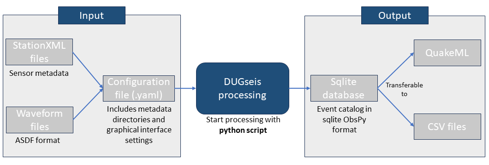

# Summary
Detecting earthquakes and compiling these to earthquake catalogs are fundamental tasks in seismology. Acoustic emission sensors allow detecting tiniest so called picoseismic events representing fractures on mm, cm or dm scale (-6<Magnitude<0). Such picoseismic events have corner frequencies of 1kHz-1MHz and cannot be handled by standard seismic processing softwares that deal with signals <500 Hz. Other commercial software for monitoring picoseismicity for structural health monitoring applications, e.g. mines does exist, but are only trigger-based. For large-scale experiments in underground laboratories (e.g., hydraulic stimulation, earthquake nucleation, nuclear waste disposal) continuous recordings of the seismicity data streams in MHz range are needed to study the rock response in great detail. The DUGseis software package is filling this gap. It was developed to manage, process and visualize continuous, high-frequency seismic data. The package can be used to create earthquake catalogs in real-time, as well as in post-processing, and directly visualize their event waveforms and locations in a graphical interface. Since the software is python based, users can easily add their own processing routines.

# Statement of need
The open source, python-based DUGseis package is designed to align with the functionalities of SeisComP [@seiscomp], a standard software used in microseismic-large scale earthquake processing (<500Hz, M>-0.5). DUGseis is tailored to picoseismic events (-6<M<0) with much higher frequency ranges (kHz-MHz), as recorded by acoustic emission sensors (AE sensors). High-frequency seismic data processing is common in mining environments to monitor tunnel stability, and became very popular in underground laboratories. Until now, these projects have employed trigger-based recordings, meaning that the incoming waveform data is only saved to disk if a pre-set trigger threshold is reached by a recorded event.  One disadvantage of the triggered recording strategy is the so-called dead time. After an event is triggered, no additional event can be triggered until the processing of the first triggered event is completed. Removing these dead times plays a significant role if high event rates are expected. With DUGseis it is possible to record and store [@DugSeisAcqui] continuous waveform data in the MHz range and directly process the data, removing these dead times.  Being Python-based, DUGseis offers a high flexibility for the researchers to complement the processing with their own Python-based codes, adjusted to the project needs. 

# Functionality and Features
The DUGseis software is a full Python-based package with the main focus to process continuous high-frequency data, extract picoseismic event waveforms and create an earthquake catalog. To make its usage and its outputs more easily accessible for seismologists, some features use modules and functions of the ObsPy package [@Beyreuther2010], a popular package in seismology.\
The DUGseis software requires sensor metadata with sensor locations and continuous waveform data in the ASDF format [@Greenfield2015; @asdf] to run. Here, the continuous waveform data was acquired using the DUGseis acquisition [@DugSeisAcqui], another software package developed specifically for the Bedretto Underground Laboratory to record and store waveform data of AE sensors in the ASDF format using specific Spectrum digitizer cards. For general usage of the here presented DUGseis package, the waveform data does not need to be acquired from DUGseis acquisition but the ASDF format can be transferred from other data formats. \
DUGseis retrieves all important information regarding data directories and processing settings from a configuration file. The configuration file can be used to open a graphical interface or can be given to the processing script. After processing the continuous waveform data, DUGseis outputs an event catalog as a database, which additionally can be saved as QuakeML or CSV files. Figure \autoref{fig:DUGseisScatch} shows the in- and output of the DUGseis processing.

***Data processing***\
The processing itself occurs within Python scripts which call different DUGseis functions, enhancing flexibility in usage.\
DUGseis was mainly developed to process continuous waveform data recorded from AE sensors in the Bedretto Underground Laboratory during hydraulic stimulation experiments[@Obermann2024]. For this purpose, it was necessary to process data in real-time during the stimulations to evaluate the hazard potential of the ongoing stimulation and to gain a direct understanding of the fluid propagation in the rock volume. In addition, after the stimulation was completed, more detailed post-processing was needed to learn more about the rock-volume response. Both, real-time analysis and post-processing, can be done using the DUGseis package. During the live processing, directories are monitored in real time for new incoming data. For the post-processing, all directories with stored continuous waveform data are given to the processing script. This continuous data is then again processed in playback, which is a big advantage compared to the trigger-based software, where only the waveforms of the already triggered events could be revisited. \
The DUGseis package includes many typical seismological processing steps to create earthquake catalogs. The steps can include a detection stage to select event candidates on a number of pre-defined sensors. This step can be useful to speed up the processing, especially in real-time. Other processing steps are the picking of all traces with different pickers (e.g. STA/LTA), locating events with a basic location algorithm and magnitude estimations, which for now are based on acoustic emission sensors. For some of the processing steps, several methods are implemented, that the user can choose. Furthermore, all processing steps can be adapted to the researcher's needs. For more detailed information on which steps were used in the Bedretto Underground laboratory, we refer to @Obermann2024.\
After the processing is finished, the outputs of the events, included arrivals and picks, are stored in a database and can also be saved as QuakeML or CSV files.

***Graphical Interface***\
Another functionality of DUGSeis is to visualize the recorded waveform data and to allow manual repicking and relocation, both in real-time and in post-processing. Within the graphical interface, not only waveforms are displayed but also the output of the processing stage, such as origin and picktimes of an event. Additionally, the event and sensor locations are shown in a 3D visualization. Figure \autoref{fig:GUI_example} shows the layout of the graphical user interface.\
The graphical interface provides the opportunity to inspect each event and display the channels that recorded the event. Additionally, manual repicking and relocating can be done here. 

# Usage
Since 2021 dozens of hydraulic stimulation experiments have been performed in the Bedretto Underground Laboratory in Switzerland [@Ma2022; @Plenkers2023; @Obermann2024]. In this context, the DUGseis package was used to detect picoseismicity by processing the incoming high-frequency waveform data in real-time and in post-processing mode [@Obermann2024]. A small seismic dataset of one of the hydraulic stimulations can be found in [@DUGseisExample].

# Acknowledgements
The submitting author, Martina Rosskopf, is funded by SNF Project “Characterizing and understanding Enhanced Geothermal Systems (EGS) - novel tools and applications in a deep underground laboratory” (200021_192151). The BedrettoLab is financed by ETH Zürich and the Werner Siemens Foundation. This paper is BULGG publication BPN_008.

# References